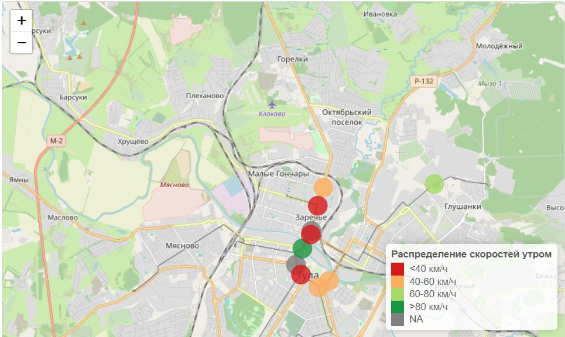
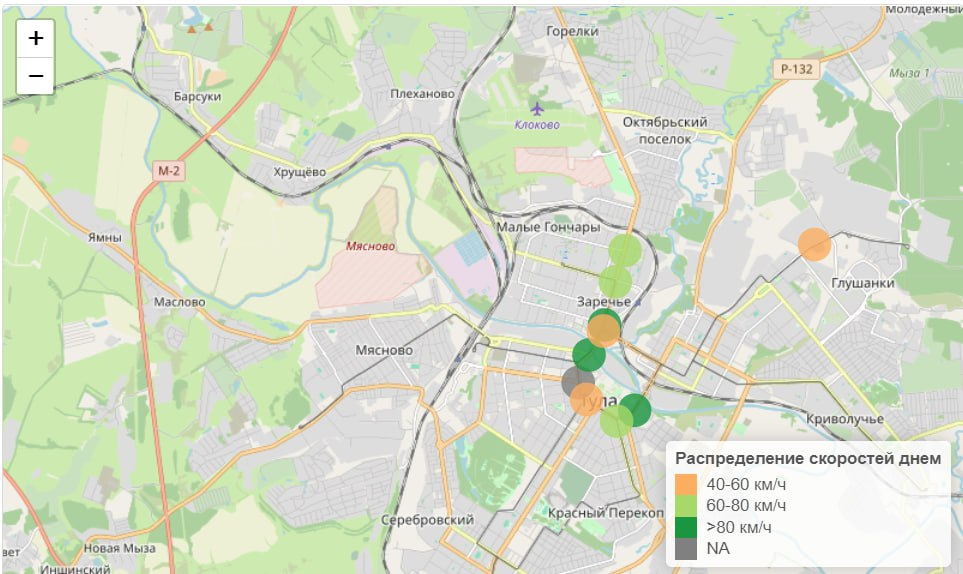
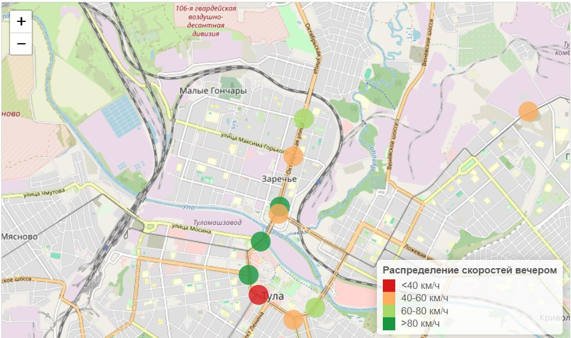
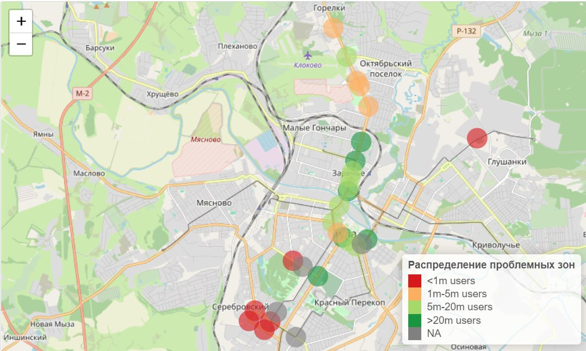
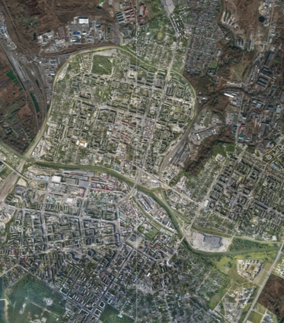
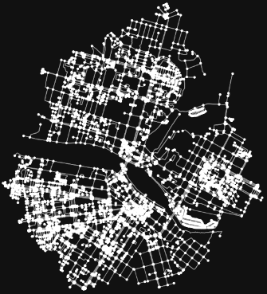
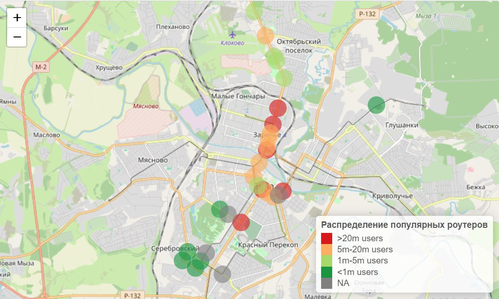

<h1 align="center">Разведочный анализ данных с Wi-Fi роутеров о перемещениях пользовательских устройств по городу</h1>

    

## Стек технологий:
+  Debian
+  ClickHouse
+  YandexCloud
+  R (tidyverse, ggplot2)
+  Python (osmnx, networkx, numpy)

## Исходные данные:
 1. Справочник расположения WiFi роутеров.
 2. Граф улично-дорожной сети (набор дуг и узлов).
 3. Набор данных за год (с выбросами, пропусками).


## Подготовка к работе с данными 
+ Импорт данных
```
rd_network <- readr::read_csv2("data/road_network.csv")
routers <- readr::read_csv2("data/wifi_routers.csv")
```
+ Анализ данных и исключение данных с пропущенными значениями

## Размещение данных в СУБД на виртуальном сервере
+ На базе YandexCloud был создан виртаульный сервер Debian
+ Импорт данных с ЯндексДиска при помощи `wget`
+ Установка ClickHouse на виртуальный сервер
+ Загрузка данных в ClickHouse `cat $(ls | grep wifi_logs_.*.csv) | tr ';' ',' | tr -d '"' | clickhouse-client`
<br>

## Проведение разведочного анализа данных
+  Проанализированы изменения дорожно-транспортной ситуации скорости движения в течении дня на основе перемещений между роутери       
  <br>
Утро      
</img>
Полдень    
</img>
Вечер    
</img>
Определены зоны с низким потоком трафика
</img>
Построена временная шкала по неделям нагруженности транспортных узлов
</img><br>
   
## Составление матрицы перемещений     
+  Матрица передвижений по городу
<p></img></img></p><br>

## Визуализация данных
+ Построена тепловая карта наиболее используемых роутеров        
</img><br>

## Предоставление комментариев
### В ходе проведённой работы были выроботаны рекомендации относительно эффективного расположения роутеров
+ Необходимо переместить роутеры с низкой проходимостью
<br><br><br>

## Авторы решения - Команда DSFans   
<p></p>
